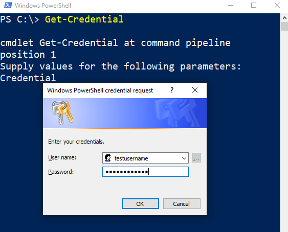
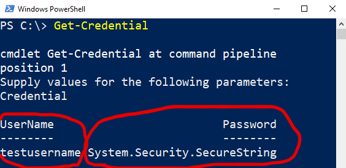

# Introduction

This article will have a deep concept about the various ways of `encoding/encrypting` and storing password using PowerShell and how to use it in authentication. Basically to know how we can keep our credential secure. So let's start!

# Get-Credential

As we all know `Get-Credential` cmdlet is the most common way we use to pass credential in PowerShell script. This cmdlet is bydefault present in PowerShell and it is present inside the module `Microsoft.PowerShell.Security`.

Let see some examples of using `Get-Credential` and it's different role and functionality.

Example 1:

In the above screenshot I have run the `Get-Credential` cmdlet and as you can see it gives a pop up and asks for the `Username` and `Password` to be passed in the field. We will unable to see the password here as it is sensitive.

Once we pass the required credential and hit ok it will create a `PSCredential` object that will have 2 attribute as `Username` and `Password` which is shown in the below screenshot.

Here the password is encrypted and stored as `SecureString` which is a `.NET class`. This is done to keep the password confidential and it automatically get deleted from the memory when the session close.

we can store the credential in a variable to use it further in our script as shown below.

