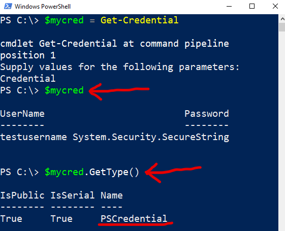
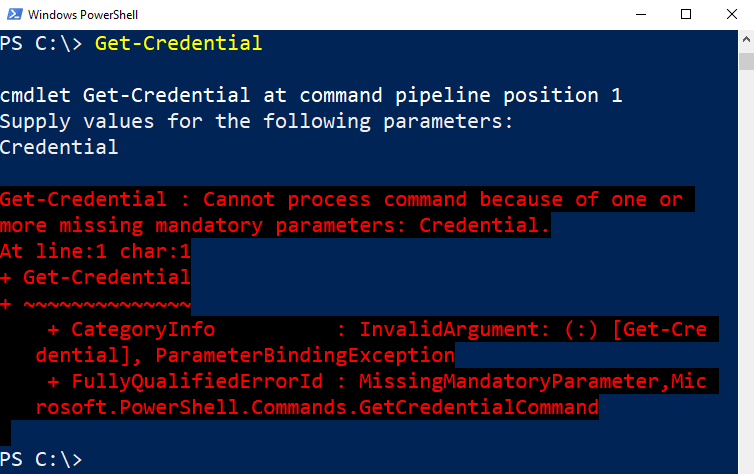
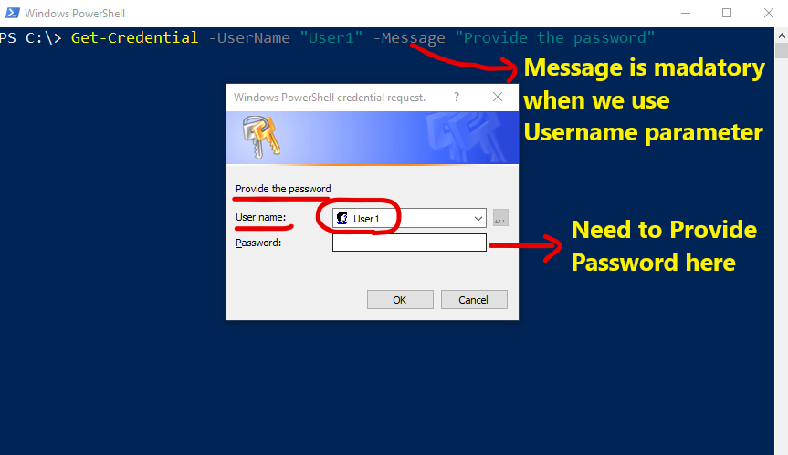
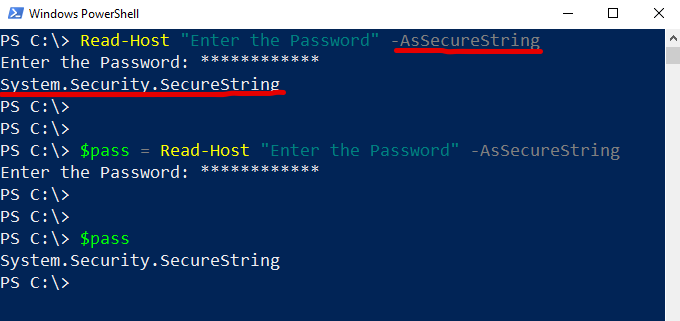
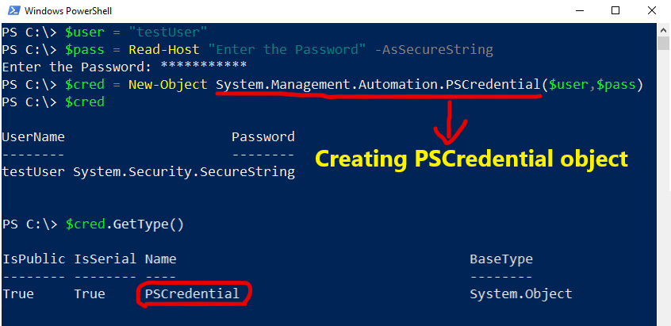

# Introduction

This article will have a deep concept about the various ways of `encoding/encrypting` and storing password using PowerShell and how to use it in authentication. Basically to know how we can keep our credential secure. So let's start!

# Get-Credential

As we all know `Get-Credential` cmdlet is the most common way we use to pass credential in PowerShell script. This cmdlet is bydefault present in PowerShell and it is present inside the module `Microsoft.PowerShell.Security`.

Let see some examples of using `Get-Credential` and it's different role and functionality.

Example 1:


In the above screenshot I have run the `Get-Credential` cmdlet and as you can see it gives a pop up and asks for the `Username` and `Password` to be passed in the field. We will unable to see the password here as it is sensitive.

Once we pass the required credential and hit ok it will create a `PSCredential` object that will have 2 attribute as `Username` and `Password` which is shown in the below screenshot.


Here the password is encrypted and stored as `SecureString` which is a `.NET class`. This is done to keep the password confidential and it automatically get deleted from the memory when the session close.

we can store the credential in a variable to use it further in our script as shown below.



`$mycred` contains the credential and can be used for authentication. As we can see here the type of `$mycred` is `PSCredential` which proves that this is a `PSCredential` object.


As a developer, we may require to check the password complexity from our end. So in that case we need to convert the secure string to text readable format and then by using regex we can check the complexity. So let's take another example to see how we can decrypt the password from secure string to text.

Example 2:

```powershell
$mycred = Get-Credential
$password = $MyCred.password
$bstr = [System.Runtime.InteropServices.Marshal]::SecureStringToBSTR($password) #converting securestring to byte string
$decryptPassword = [System.Runtime.InteropServices.Marshal]::PtrToStringAuto($bstr) #converting byte string to string
[Runtime.InteropServices.Marshal]::ZeroFreeBSTR($BSTR) #recommended to free the byte string memory after conversion
```

Output:


As we can observe from the output we have successfully converted the secure string to text readable format. We have used `Marshal` class for the conversion by calling some of its static method.

`SecureStringToBSTR($password)` this method is used to convert the secure string to byte format and it is compulsory to pass the argument as a secure string otherwise it will throw error. `PtrToStringAuto($bstr)` method takes the binary string as an input and then convert that to the actual string.

Once we are done with the conversion we need to free up the `BSTR` memory space by calling `ZeroFreeBSTR($BSTR)` method, because according to [Marshal.SecureStringToBSTR](https://docs.microsoft.com/en-us/dotnet/api/system.runtime.interopservices.marshal.securestringtobstr?redirectedfrom=MSDN&view=netframework-4.8#System_Runtime_InteropServices_Marshal_SecureStringToBSTR_System_Security_SecureString_) documentation this process allocates the unmanaged memory required for a string so it's a good practise to free that memory space.

Now as we have decrypted our password we should be aware that this password is now unsecure in our memory. Once we are done with the validation or complexity check we need to remove the text from memory.

Let's take another example to see the parameters present in Get-Credential and how we can use them in our script.

Example 3:


As we can see from the above screenshot there are 2 kinds of parameter set that means we can use the `Get-Credential` cmdlet in 2 ways. So there are in total 3 parameters `-Credential`, `-UserName` and `-Message`.

By default when we run `Get-Credential` then we get a popup asking the user to input the credential, so the given input is then converted into `PSCredential` and pass as an argument to `Get-Credential` function. so `-Credential` takes `PSCredential` object as an input. If we will manually pass a string in `-Credential` then it will give the same pop up showing the input string as the username and will keep the password field blank, once we give the password it will convert that to the `PSCredential` object first. Let see the same in below screenshot.


As explained above it is asking me to pass the value to the parameter, if we don't pass any value and press cancel then it will throw an error stating `Get-Credential : Cannot process command because of one or
more missing mandatory parameters: Credential.` as shown below.



We have another way of using `Get-Credential` where we can pass `-UserName` and `-Message`



As you can see in the above screenshot both `-UserName` and `-Message` has been passed together and password field is empty and needs to be filled by the user. This is another way of using `Get-Credential` where it give flexibility to user by passing default username and if user want can change the username value.

We can also take the password from user during run time by `Read-Host` cmdlet. So Let see how we can secure a string and pass password using `Read-Host`

# Read-Host

`Read-Host` cmdlet is used to take input from the user during run time. So if we want to read the password from user then we can use `Read-Host` in the following way:

```powershell
Read-Host "Enter the Password" -AsSecureString
$pass = Read-Host "Enter the Password" -AsSecureString
$pass
```



As we can see `Read-Host` cmdlet has a parameter called `-AsSecureString` which converts normal `string` to `securestring` as you can see in the above screenshot. We can store the value in a variable to use it further in our code. Here I have stored in `$pass` variable.  

So let see how to convert the following user ID and password to `PSCredential` object.

```powershell
$user = "testUser"
$pass = Read-Host "Enter the Password" -AsSecureString
$cred = New-Object System.Management.Automation.PSCredential($user,$pass)
$cred
```



As you can see from the above screenshot we have created `PSCredential` by passing required Username and Password. Now we can use `$cred` variable as a credential object.

Now let's move on to another concept where we will use `ConvertTo-SecureString and ConvertFrom-SecureString` cmdlet to convert a simple string to secure string and where we can use this cmdlet to achieve our desire output.

# ConvertTo-SecureString and ConvertFrom-SecureString
If we have a case where we have to generate a random password by the help of our script and converting it to PSCredential for further use then `Convertto-securestring` cmdlet plays a vital role to fulfil our requirement.

From the name itself we can recognise that it converts a value to `securestring`


